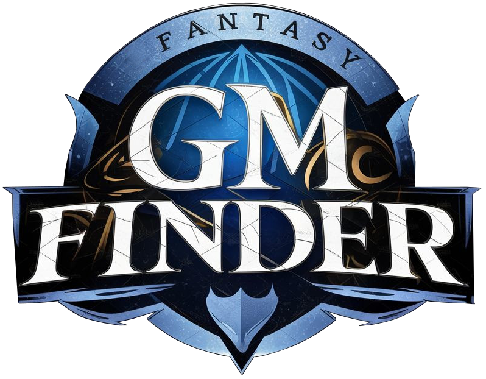

# GM Finder - Frontend



## Developed by:

- Kevin Luca Bochenski Badellino  
- Alex Chihaia  
- Gaetano Panico  
- Giacomo Rebussi  
- Diego Romeo

## What is GM Finder?

GM Finder is a website connecting players of Tabletop Role-Playing Games with the Game Masters that will guide them in their adventures. The website is entirely developed in Laravel (backend) and Vue.js (frontend).

## Features - Frontend


The core feature of GM Finder is its search functionality. Users can search for Game Masters based on the game systems they use. It is then possible to refine the search based on the Game Master's average rating and number of reviews.


Clicking on a card in the searh results brings the user to an info page about the selected Game Master, displaying a vaiety of useful details.


From this page it is possible to rate and review a Game Master or to send them a message and ask about joining their game.

## Features - Backend


A user interested in becoming a Game Master can create a Game Master account. This gives access to a backoffice section where a Game Master can enter and edit information about their game and view the messages and reviews they received.


The "My Stats" section allows the Game Master to see useful statistics about their account for a given time period, like the number of messages they received, the number of reviews, and the ratings distribution.


The "Promotions" section lets the Game Master promote their account for a limited time.


This results in their account appearing more prominently in the search results, as well as in a dedicated "Featured" section in the Home Page.

## How to Install this Project

1. Clone the backend repo: https://github.com/OgataiKhan/gmfinder-backend

2. Modify the following variables in the `env` file:

```php
DB_USERNAME=yourusername
DB_PASSWORD=yourpassword

BRAINTREE_ENV=sandbox
BRAINTREE_MERCHANT_ID=yourid
BRAINTREE_PUBLIC_KEY=yourkey
BRAINTREE_PRIVATE_KEY=yourprivatekey

FRONTEND_URL=frontendurl
```

Make sure you are connected to the database.  
Note that you will need a Braintree Sandbox Account if you want the test payment system to work.

3. Run:

```bash 
composer install
cp .env.example .env
php artisan key:generate
php artisan migrate
php artisan db:seed
php artisan storage:link
npm install
php artisan serve
```

4. In a different terminal window, run:

```bash 
npm run dev
```

5. Clone this repo.

6. In the frontend folder, run:

```bash 
npm install
npm run dev
```

7. Enjoy!